# DaGuDak 

웹 경마 사이트
- 기간 : 20. 10. 18 ~ 20. 11. 05
- 팀원 : 5명
- 개발툴 : eclipse IDE, Oracle sqldeveloper
- 주제 : Spring MVC 패턴을 사용한 Web 경마 사이트

&nbsp;&nbsp;&nbsp;

&nbsp;&nbsp;&nbsp;

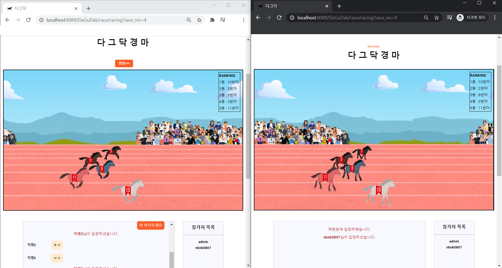

&nbsp;&nbsp;&nbsp;

&nbsp;&nbsp;&nbsp;

# Project Structure
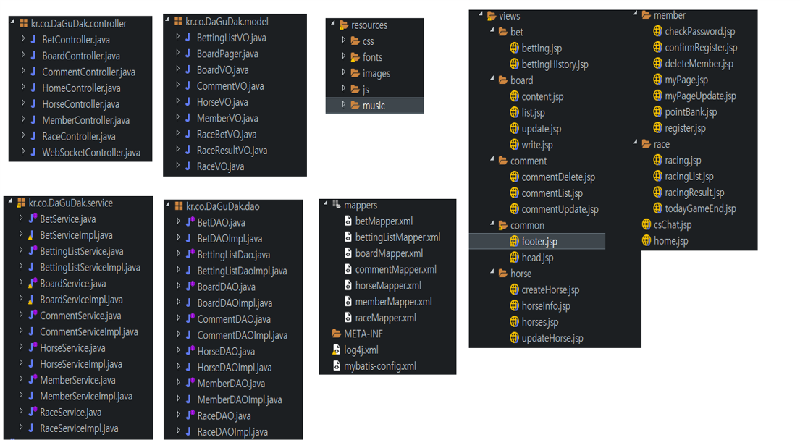
- Spring MVC 패턴으로 Controller, Service, DAO, Model 구성
- JSP를 이용한 views
- Mybatis를 이용한 mappers

  

# 🛠 사용 기술 및 라이브러리

- Java(jdk 1.8), JSP, MyBatis, Oracle
- Spring Framework, Eclipse
- HTML, CSS, JavaScript, jQuery , Json, Ajax, WebSocket

  

# DB Modeling

&nbsp;&nbsp;&nbsp;

Race Tables

#### HORSE
 - 경주마의 정보를 저장합니다.
  
#### RACE
 - 경기 일정과 출전하는 경주마의 정보를 저장합니다.
 
#### MEMBER
 - 회원 정보를 저장합니다.
 
#### BETTING_LIST
 - 회원들이 경기에 베팅한 정보를 저장합니다.
   

&nbsp;&nbsp;&nbsp;

Board Tables

#### BOARD
 - 게시판 게시글 정보를 저장합니다.

#### COMMENTS
 - 게시글에 달린 댓글 정보를 저장합니다.

&nbsp;&nbsp;&nbsp;

&nbsp;&nbsp;&nbsp;
# ✍️ ****Summary****

## 기획 의도 ## 
  - 단순한 CRUD 기능 외에 모두가 참여할 수 있고 즐길 수 있는 요소를 추가 
  - 다수의 클라이언트가 직접 참여할 수 있는 프로젝트 
  - Spring framework, JavaScript, WebSocket 등 다양한 기술 활용 목적 
    
## 주요 기능 ##

회원 CRUD

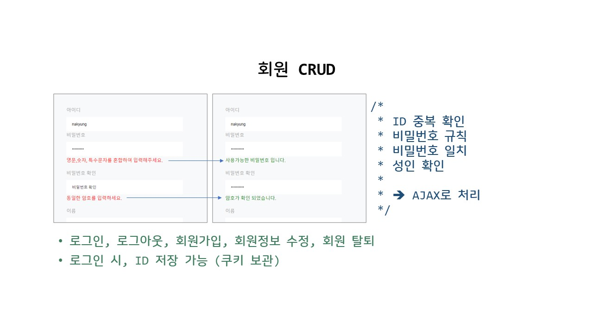
 

이니시스 결제 시스템을 통한 포인트 충전

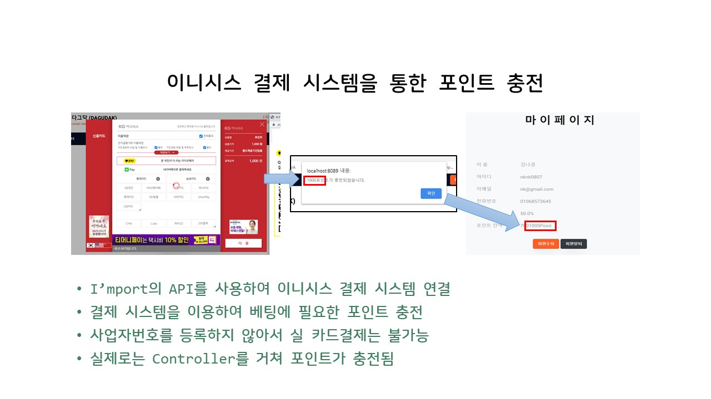
 

게시판 CRUD (게시글, 댓글)

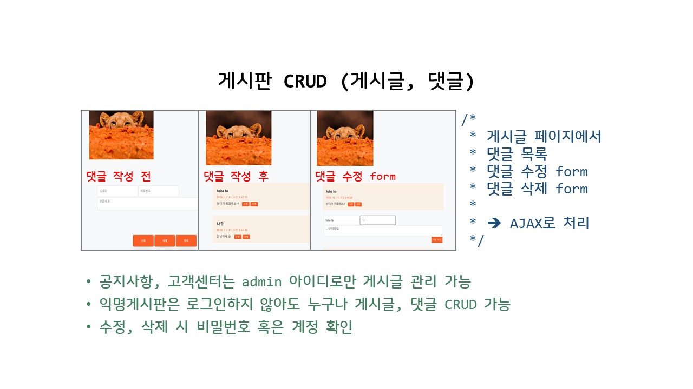
 

네이버 뉴스검색API를 이용한 경마 뉴스 게시판

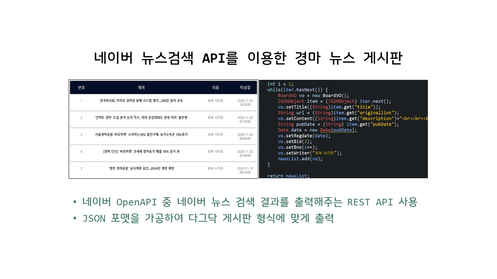
 

경주마 및 경기 CRUD

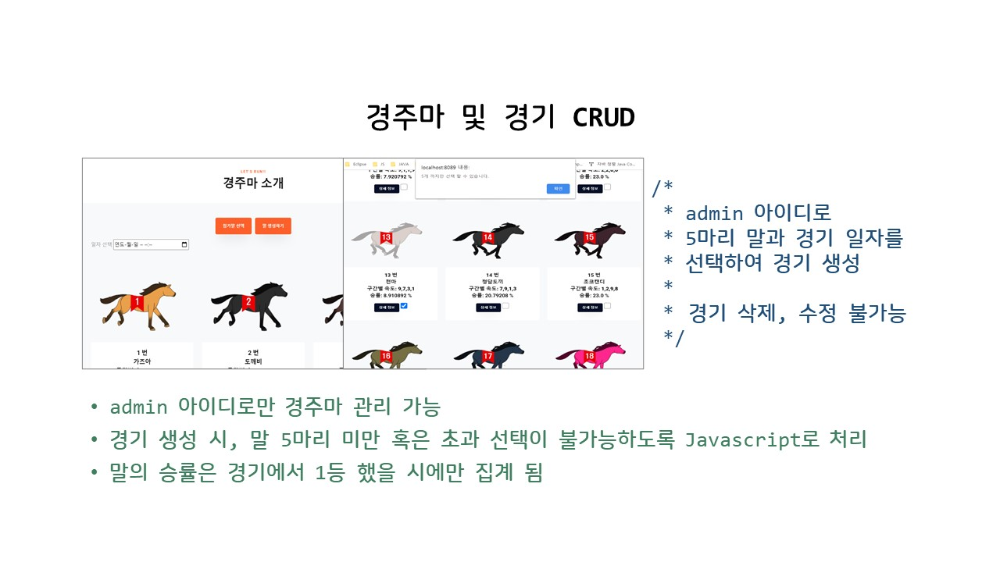
 

베팅

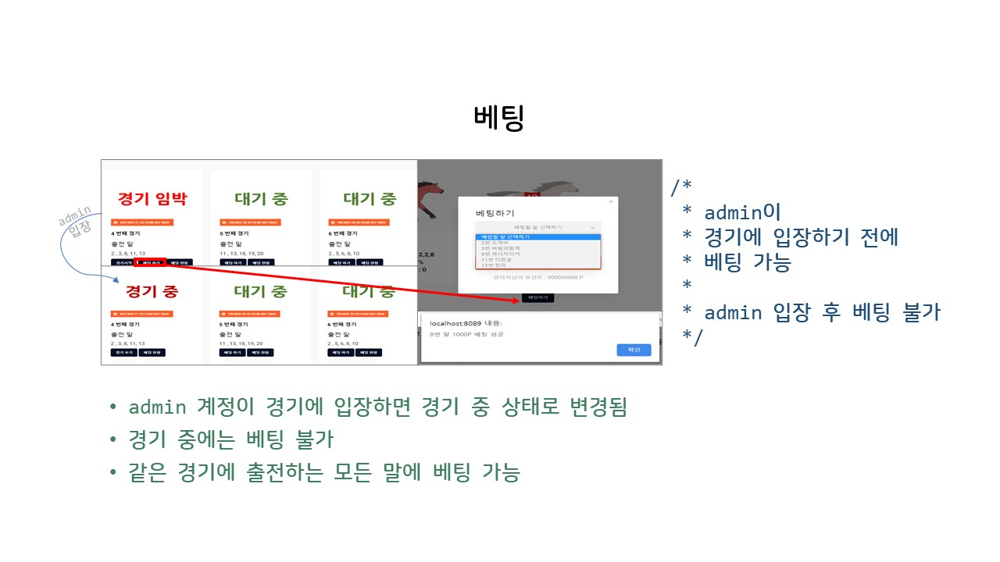
 

상금

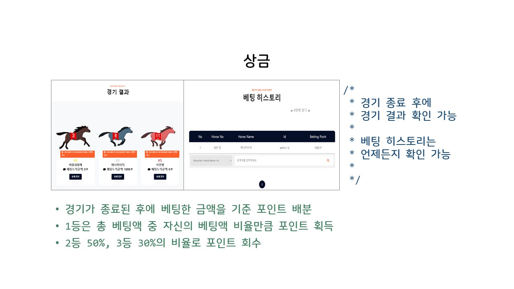
 

Javascript로 구현한 경마 게임

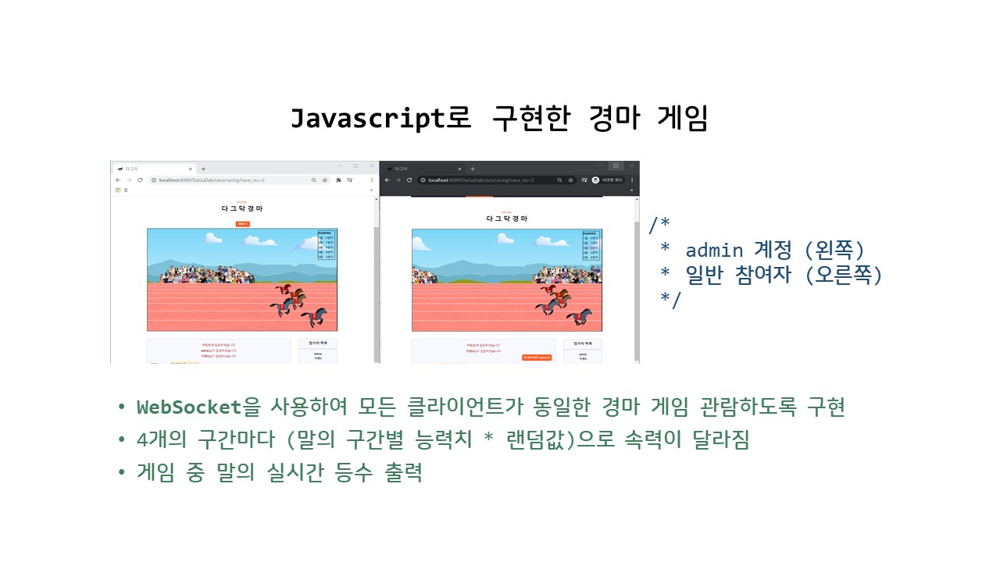
 

WebSocket을 이용한 실시간 경기 및 채팅

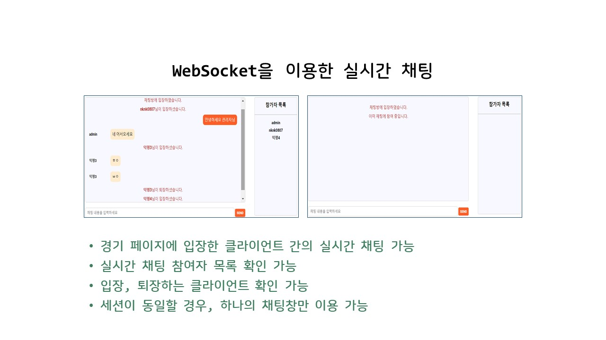
 

  
