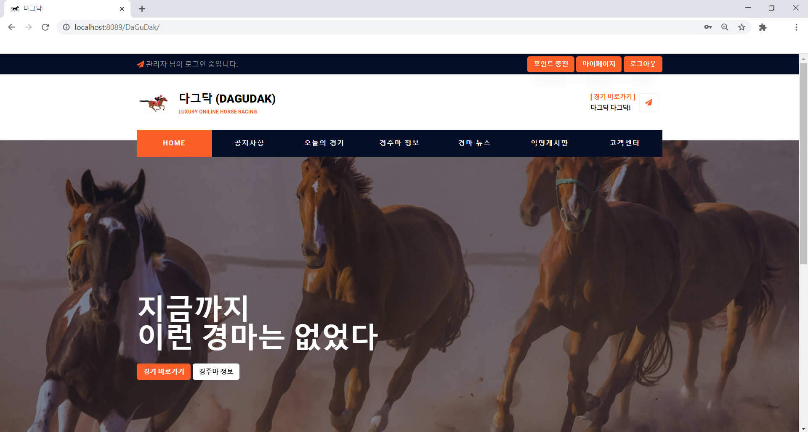
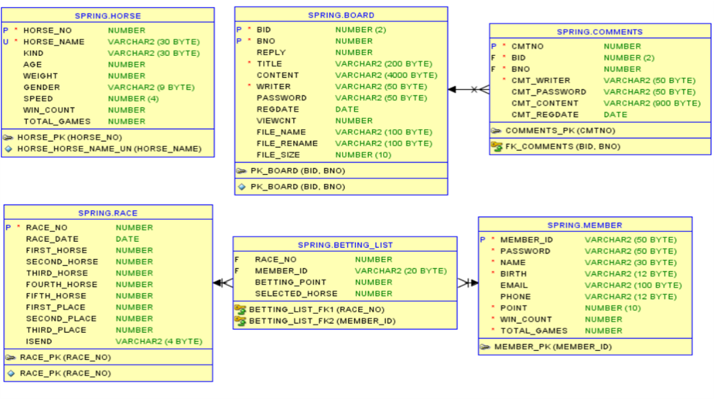

# DaGuDak 
웹 경마 사이트
- 기간 : 20. 10. 18 ~ 20. 11. 05
- 팀원 : 5명
- 개발툴 : eclipse IDE, Oracle sqldeveloper
- 주제 : Spring MVC 패턴을 사용한 Web 경마 사이트

&nbsp;&nbsp;&nbsp;

&nbsp;&nbsp;&nbsp;

&nbsp;&nbsp;&nbsp;

# Technologies
 - Java, JavaScript
 - Spring Framework
 - Oracle
 - WebSocket
 - MyBatis, DOM, jQuery, Json, AJAX 등

&nbsp;&nbsp;&nbsp;

# Project Structure

- Spring MVC 패턴으로 Controller, Service, DAO, Model 구성
- JSP를 이용한 views
- Mybatis를 이용한 mappers

&nbsp;&nbsp;&nbsp;

# DB Modeling

&nbsp;&nbsp;&nbsp;

Race Tables

#### HORSE
 - 경주마의 정보를 저장합니다.
  
#### RACE
 - 경기 일정과 출전하는 경주마의 정보를 저장합니다.
 
#### MEMBER
 - 회원 정보를 저장합니다.
 
#### BETTING_LIST
 - 회원들이 경기에 베팅한 정보를 저장합니다.
   

&nbsp;&nbsp;&nbsp;

Board Tables

#### BOARD
 - 게시판 게시글 정보를 저장합니다.

#### COMMENTS
 - 게시글에 달린 댓글 정보를 저장합니다.

&nbsp;&nbsp;&nbsp;

# Summary

회원 CRUD

 

이니시스 결제 시스템을 통한 포인트 충전

 

게시판 CRUD (게시글, 댓글)

 

네이버 뉴스검색API를 이용한 경마 뉴스 게시판

 

경주마 및 경기 CRUD

 

베팅

 

상금

 

Javascript로 구현한 경마 게임

 

WebSocket을 이용한 실시간 경기 및 채팅

 

&nbsp;&nbsp;&nbsp;

# Demo

